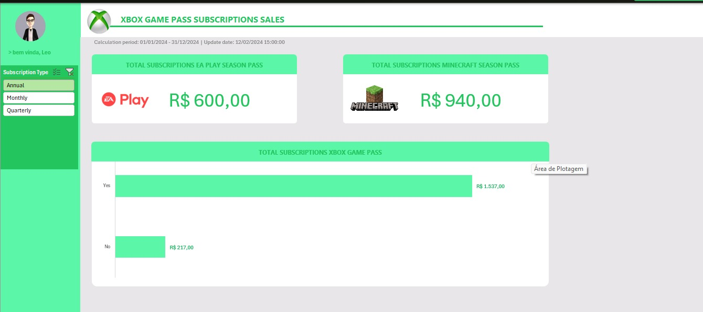

# 📊 Dashboard de Performance de Vendas - Excel 

Este repositório contém um dashboard desenvolvido para o monitoramento estratégico de vendas. O projeto transforma dados brutos em insights visuais, facilitando o acompanhamento de metas, faturamento e desempenho de equipes.

---

## 📝 Sobre o Projeto
O objetivo deste dashboard é fornecer uma visão 360º do ecossistema de vendas. Através dele, é possível identificar padrões de consumo, sazonalidade e a eficiência de cada vendedor em tempo real (baseado na atualização dos dados).

### Principais KPIs Monitorados:
* **Faturamento Bruto:** Valor total das vendas realizadas.
* **Atingimento de Metas:** Comparativo entre o volume vendido e os objetivos estabelecidos.
* **Performance por Categoria:** Identificação dos produtos de maior saída.
* **Ranking de Vendedores:** Análise de produtividade individual da equipe.

---

## 🛠️ Tecnologias e Estrutura
O projeto foi construído utilizando as melhores práticas de Excel para BI:

* **ETL (Extração e Tratamento):** Realizado na aba `Bases`, garantindo integridade dos dados.
* **Camada de Processamento:** Aba `Cálculos` com fórmulas avançadas e tabelas dinâmicas para processar as métricas.
* **Interface (UI/UX):** Aba `Dashboard` com design limpo e navegação intuitiva.
* **Recursos Visuais:** Utilização de `Assets` personalizados para ícones e backgrounds.

---

## 📸 Visualização do Dashboard

---

## 📂 Como Utilizar
1.  **Download:** Baixe o arquivo [`Dashbord de Vendas.xlsx`](https://github.com/marcosrmaciel42-png/Dashboard-de-Vendas/blob/c72e0cdefaf02d832a873d7731d4c6b1a64a1daa/Dashbord%20de%20Vendas.xlsx) deste repositório.
2.  **Habilitação:** Ao abrir, clique em "Habilitar Edição" e "Habilitar Conteúdo" para que as fórmulas e conexões funcionem.
3.  **Filtros:** Utilize os botões de segmentação (Slicers) para navegar entre períodos e categorias.

---

## 💡 Habilidades Demonstradas
* Limpeza e estruturação de bases de dados.
* Criação de indicadores de performance (KPIs).
* Visualização de dados (DataViz) aplicada ao negócio.
* Uso de fórmulas lógicas e de busca (Procv/Xlookup, Se, Somases).

---

